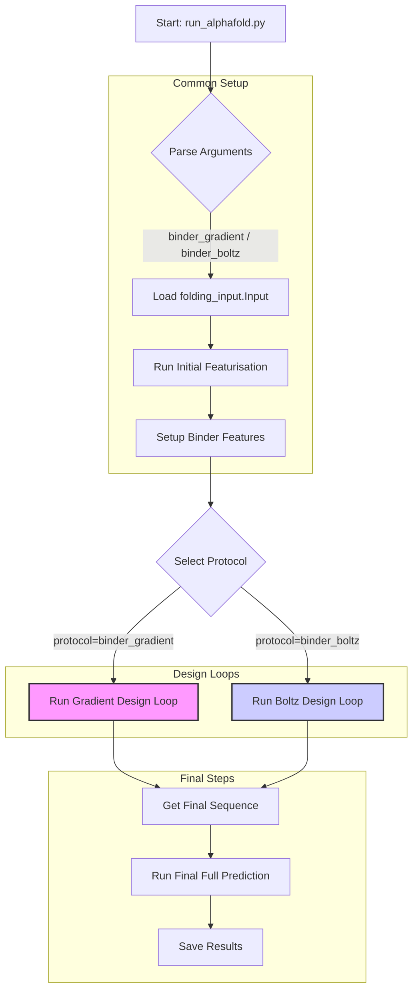
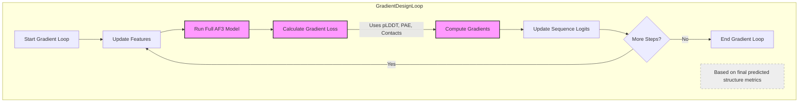
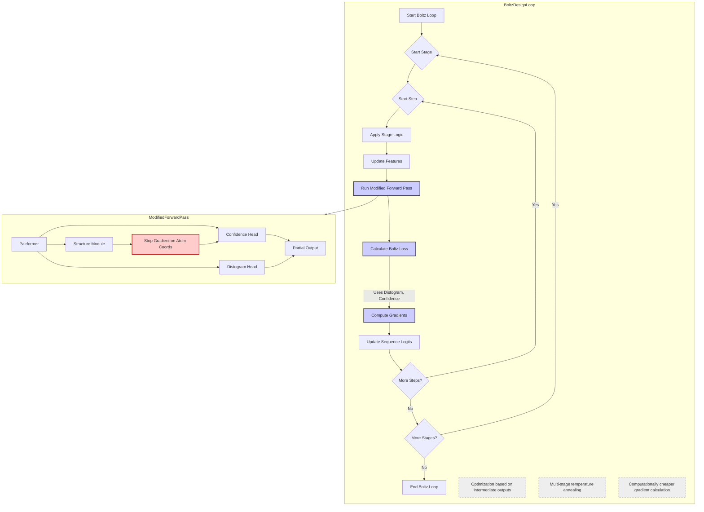
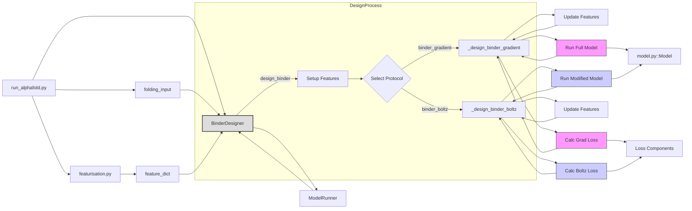

# Visual Introduction to AlphaFold 3 Binder Design Protocols
This document provides a visual overview of the two main binder design protocols implemented in this codebase: `binder_gradient` and `binder_boltz`. These diagrams illustrate the high-level flow, key steps, and relevant code components for each approach.
## Overall Workflow
Both binder design protocols share initial setup steps before diverging into their respective optimization loops.

**Key Files Involved:**
*   `run_alphafold.py`: Main script, argument parsing, orchestrates the overall process, calls featurisation and design.
*   `src/alphafold3/common/folding_input.py`: Defines the `Input` object structure.
*   `src/alphafold3/data/featurisation.py`: Handles the conversion of `Input` to `feature_dict`.
*   `src/alphafold3/design/binder_utils.py`: Contains helper functions like `setup_binder_features` and `update_features_from_logits`.
*   `src/alphafold3/design/binder_design.py`: Implements the core `BinderDesigner` class and the `_design_binder_gradient` / `_design_binder_boltz` methods.
*   `src/alphafold3/design/binder_loss.py`: Defines the loss calculation logic for both protocols.
*   `src/alphafold3/model/model.py`: Defines the core `Model` architecture.
## Protocol 1: `binder_gradient` (ColabDesign-like)
This approach uses the full AlphaFold 3 model output for loss calculation and backpropagates gradients through the entire network, including the structure module.

**Key Characteristics:**
*   **Model Use:** Leverages the complete AlphaFold 3 prediction result.
*   **Loss:** Typically based on pLDDT of the binder, PAE at the interface, and predicted contacts.
*   **Gradients:** Flow back through the entire model (Pairformer, Structure Module, Confidence Head).
*   **Cost:** More computationally expensive per step due to full backpropagation.
## Protocol 2: `binder_boltz` (BoltzDesign1-like)
This approach uses a modified forward pass, stopping gradients before the structure module, and optimizes based on intermediate outputs (Distogram, Confidence). It employs a multi-stage optimization schedule.

**Key Characteristics:**
*   **Model Use:** Special `boltz_design` mode stops gradients at the structure module.
*   **Loss:** Primarily based on Distogram contacts and Confidence Head outputs (pLDDT, PAE).
*   **Gradients:** Flow back only through Pairformer and Confidence Head, *not* the Structure Module.
*   **Optimization:** Uses a 4-stage process with varying temperatures and sequence representations.
*   **Cost:** Less computationally expensive per step due to partial backpropagation.
## File/Function Call Hierarchy (Simplified)

This hierarchy shows how `run_alphafold.py` orchestrates the process, utilizing `featurisation` and the `BinderDesigner`. The designer then calls helper utilities (`binder_utils.py`) and specific loss functions (`binder_loss.py`), interacting with the core `ModelRunner` (which wraps the `Model` from `model.py`) in different ways depending on the selected protocol.